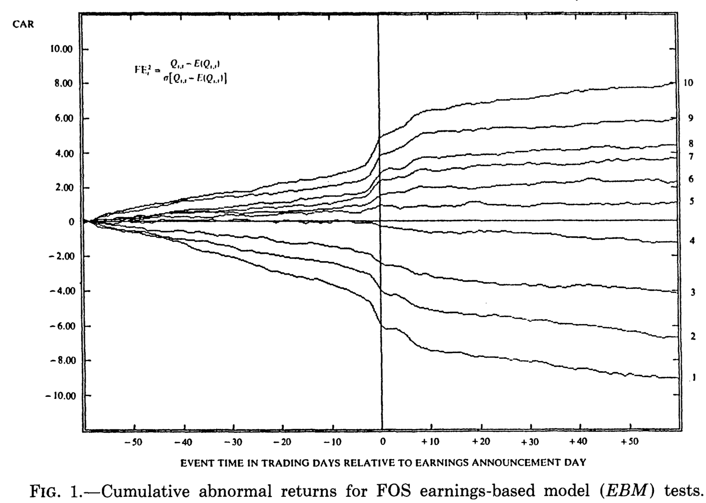
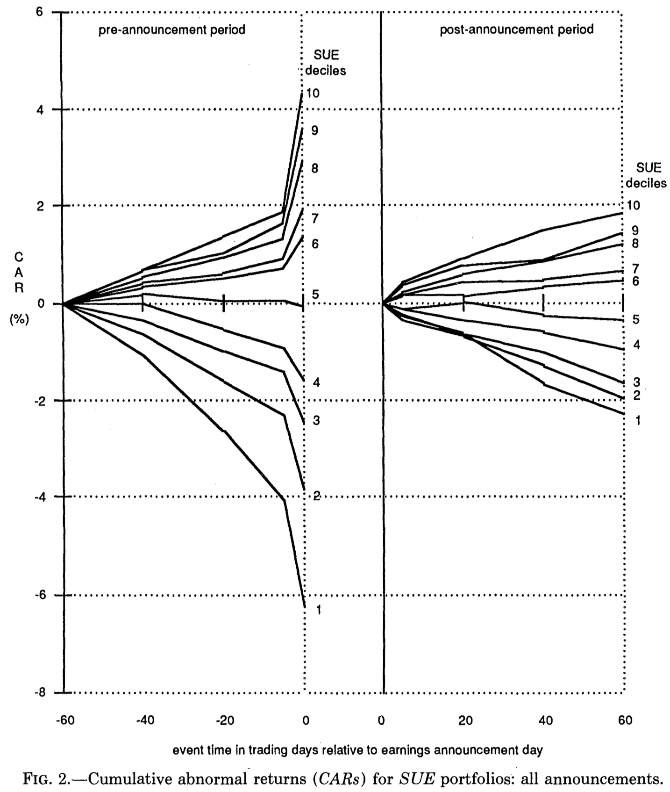
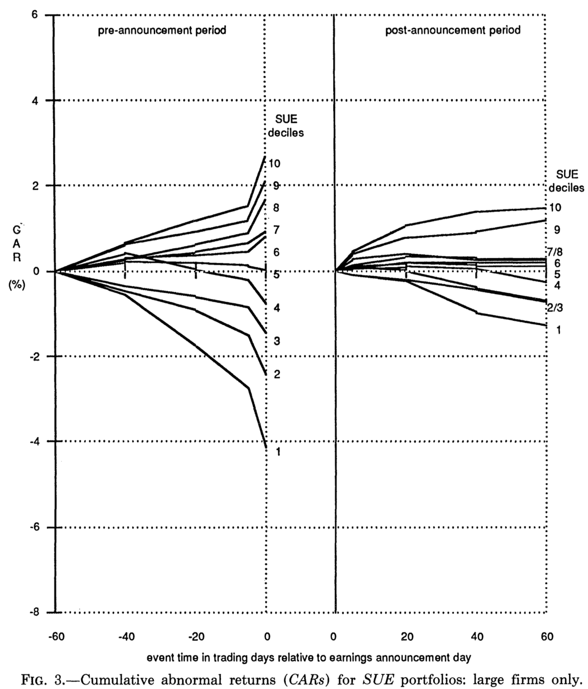
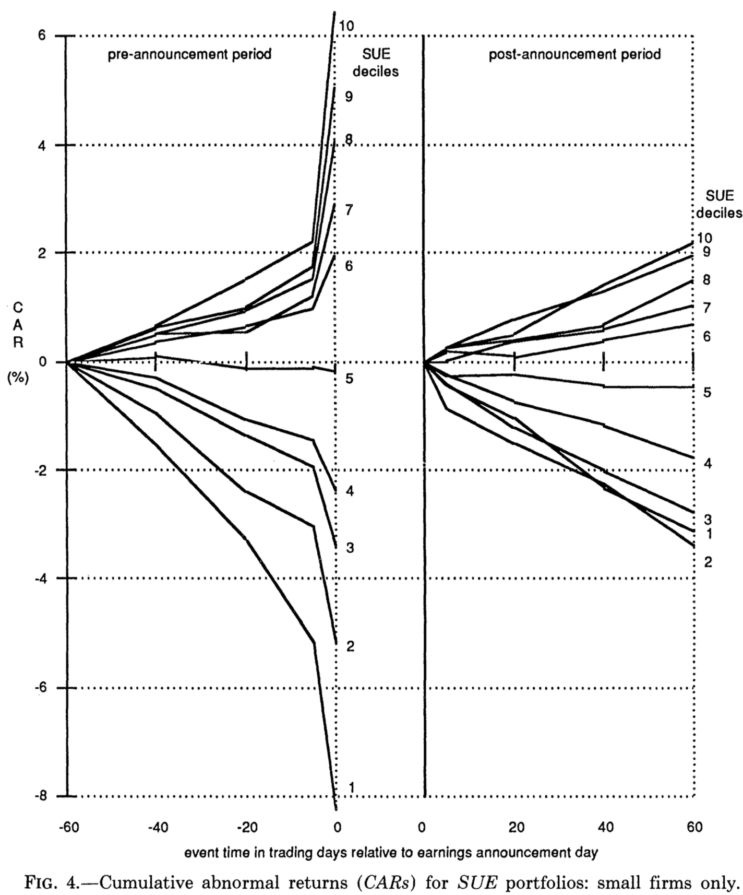

# PostEarningsDrift
Replication and out-of-sample extension of the post-earnings-announcement drift anomaly (Bernard & Thomas, 1989)

### Information
Final report: at most 10 pages including appendices and references (12pt Times New Roman font, 1.5 line spacing).

### Steps
1. Understand the research question, methodology, and key findings of the paper
2. Reproduce the main empirical results using real financial data
3. Extend the sample period to the most recent available time period
4. Evaluate whether the original conclusions still hold out of sample (after the original sample period ends)
5. Submit a brief report that summarizes your work, results, and interpretation

$\ $
# Paper analysis

## 1. Introduction

**Goal**: Evaluation competing explanations for the post-earnings-announcdement drift (PEAD). 

**Competing explanations**
- A portion of the price response to new information is delayed: failing to assimilate new information, costs (transaction, opportunity costs of implementing a strategy) overcome the gain.
- CAPM is wrong and raw returns aren't fully adjusted for risk: these returns aren't abnormal but aren't capture by CAPM

**Alternative explanation of the delay**:
"Prices are affected by investors who fail to recognize fully the implication of current earnings for future earnings".

$\ $
## 2. Description of the PEAD anomaly

PEAD first documented by Ball and Brown (1968), later decile-based long-short strategy proposed by Folster, Olsen and Shevlin (1984) (FOS) achieves 25% abnormal returns over subsequent 60 days period.

**Figure 1**: 
FOS cumulative abnormal returns (CAR).
Not a finding of this paper, only replicated.

Followed by a discussion of the competing explanations and a short literature review.

$\ $
## 3. Research

### 3.1. DATA
**84,792** firm-quarters of data for NYSE/AMEX firms over a 12 years period (1974-86). *That's 48 quarters, so there are approx. 1766.5 firms in the sample*.

**15,457** firm-quarter data for stocks from the NASDAQ (1974-1985) (but NASDAQ isn't use in their study? I think we can skip this part).

Critera inclusion: see those used by FOS.

**Requirement**
- firm listed on the CRSP daily files
- firm's earnings before extrordinary items and discontinued opoeration be available for at least 10 consecuutive quarters (on Compustat)
They have a potential survirorship bias: they use Compustat, some firms have been dropped since the beginning of the sample.

$\ $
### 3.2. METRICS

**3.2.1. ABNORMAL RETURNS**
$$ \begin{aligned}
&AR_{jt}=R_{jt}-R_{pt} \\
&AR_{jt}=\text{Abnormal return for firm j, day t} \\
&R_{jt}=\text{Raw return for firm j, day t} \\
&R_{pt}=\text{Equally weighted mean return for day t on the NYSE/AMEX firm size (market value of common equity) decile that firm j is a member of at the beginning of the calendar year}
\end{aligned}$$

For every year in the sample, we have to split our firms in market value deciles in order to compute abnormal returns.

We exclude some observations:
- returns from the earnings announcement day was missing on CRPS
- CRSP returns series did not encompass 160 trading days surrounding the earnings announcement
*We shouldn't encounter these issues with modern techniques, but a simple dropna will ensure that we follow their procedure.*

$\ $

**3.2.2. STANDARDIZED UNEXPECTED EARNINGS (SUE)**

Same as those used by FOS in their EBM model 2: this will make it easy for us to replicate figure 1, because it is mainly based on this metric.

Earnings are forecasted by estimating the **Foster (1977)** model (==to check==). 
- earnings follow a first-order autoregressive process in seasonal differences
- we use max 24 observations to estimate the Foster model
- with fewer than 16 quarters observations are assumed to have earnings following a seasonal random walk.

SUE is the difference between actual and forecasted earnings, scaled by the SD of forecast errors over the estimation period: this give **SUE** (standardized unexpected earnings).

$\ $

**3.2.3. PORTFOLIO ASSIGNMENT**

To avoid look ahead bias for firms who have not yet announced earnings for the quarter, portfolio assignment is done on the basis of their standings relative to the distribution of unexpected earnings in the *prior* quarter.

$\ $

**3.2.4. CONTINUOUSLY BALANCED SUE**

On a given day, we identify any firms that :
- 1. announced earnings 
- 2. where SUE fall in the 1th of 5th quantile of the *prior*-quarter distribution

If both 1th and 5th quantile exist for that day, we assume a long-short position in these. Long(short) positions are initially equally weighted across the available good(bad) firms, and the long exactly offsets the short.

We compute buy-and-hold continuously compounded returns on each of these stocks in the long and short position over the 60 trading days subsequent to the earnings announcement.

When no 1th and 5th quantile exist for a day (what %? For them its **14%**), we wait until a **match** become available. 
*e.g.* Two good firms drop earnings on t1, but no bad firms does. If the first available bad firm new is on t4, it would be matched with all good news firms announcing from t1 to t4, and we would then compute returns from day 5 through 64. In **97%** of case, a match is available within 2 days.

$\ $

## Section 4: Results

### 4.1. DESCRIPTIVE RESULTS (plots and regression)

**4.1.1. MAGNITUDE OF THE DRIFT**

Results based on the procedures used by FOS.

**Figure 2**: CAR plots after assigning firms to portfolios on the basis on SUE deciles, separating CAR plots for the pre and post announcement periods. 84,792 announcements from 1974 to 1986, CARs are the sums over pre and post announcement holding periods (beginning day -59 and day 1) and the difference between daily returns and NYSE/AMEX firms of the same size decile.

Result: a long D1 - short D10 strat would yield a 4.2% abnormal return over the 60 days subsequent period (18%). It's 17% for the continuously balanced SUE.

*/!\ unsure if we'll be able to replicate this result: do we have access to such old data? Otherwise, we'll just extend.*

**4.1.2. RELATION OF DRIFT TO FIRM SIZE**

We assign NYSE/AMEX firms to SUE deciles before segregationby size (not done for NASDAQ: approx. 70% of NASDAQ firms would be classified as small relative to NYSE/AMEX firms, 20% medium, 5% large).

- SUE 60 days abnormal returns: small: 5.3%, medium: 4.5%, big: 2.8%.
- CB SUE 60 days abnormal returns: small: 5.1%, medium: 4.3%, big: 2.8%.

**Regression** : FOS (1984. p595) approach to test statistical inference of the drift. Significant at 0.01.

**Plots**
- **Figure 3**: same as figure 2, but for large firms only.
{width=10%}
- **Figure 4**: same as figure 2, but for small firms only.

**4.1.3. LONGEVITY OF THE DRIFT**

Table 1: longevity of the postannouncement drift for firms in lowest and highest SUE decile, broken down by size and subperiods up to 2 years after the earnings announcement date.

**Results** (assuming that all drift occurs within 480 days):
- large amount of the 60-day drift occurs within the first 5 days of the earnings announcement: drift isn't constant, instead of 8% of the drift arising in the first 5 days out of 60, its 13%, 18% and 20% (small, medium, large)
- most of the drift: first 60 days (small: 53%, medium: 58%, large: 76%)
- no significant drift beyong 180 days
- 100% of the drift: 9 months for small firms, 6 months for larger firms.

### 4.2. TEST OF RISK PREMIUMS AS EXPLANATION FOR THE DRIFT (regressions)

**4.2.1. SHIFTS IN BETAS**

Beta estimates: derived using the BKW methodology (1988) allowing betas to shift through time.

For each of several 60-day windows surrounging the earnings announcement, we compound total returns on:
- individual stocks $R_{jt}$
- treasury bills $R_{ft}$ (derived on a daily basis from weekly returns calculated by Gautam Kaul for bills in their final week before maturity, allocated to days assuming same return for each day within the week)
- value-weighted CRSP index $R_{mt}$

The constitue a single observation for a regression based on the CAPM: $$R_{jt}-R_{ft}=a+b(R_{mt}-R_{ft})+e_{jt}$$

We regress all observations for a given SUE decile within 6 60-trading days windows surrounding earnings date.

Analysis of regression results and discussion.

**4.2.2. APT risk factors as potential explanations**

Regression of calendar-quarter returns on the COS contrrol portfolio strategy against quarterly measures of five risk factors + return on the NYSE index.

**4.2.3. Consistent profitability of the strategy**

To check: 
FOS (1984. p595) for the regression methodology